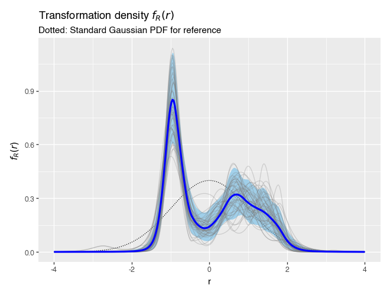
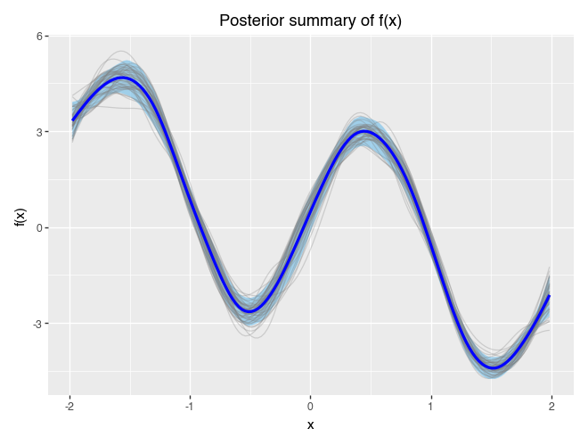
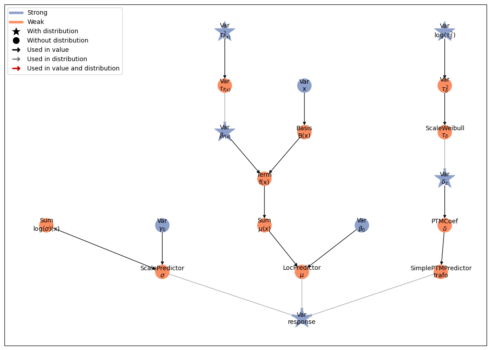

# Penalized Transformation Models in Liesel

[](https://github.com/liesel-devs/liesel-ptm/actions/workflows/pre-commit.yml)
[](https://github.com/liesel-devs/liesel-ptm/actions/workflows/pytest.yml)
[](https://github.com/liesel-devs/liesel-ptm/actions/workflows/pytest.yml)


Penalized Transformation Models are a class of flexible structured additive
distributional regression models. This is a Python library for estimating these models
with Markov Chain Monte Carlo (MCMC) methods.

Learn more in the paper:

Brachem, J., Wiemann, P. F. V., & Kneib, T. (2024). Bayesian penalized transformation models: Structured additive location-scale regression for arbitrary conditional distributions (No. arXiv:2404.07440). arXiv. `https://doi.org/10.48550/arXiv.2404.07440 <https://doi.org/10.48550/arXiv.2404.07440>`_

## Installation

The library can be installed from GitHub:

```
$ pip install git+https://github.com/liesel-devs/liesel-ptm.git
```


## Getting Started


This is a simple example for first steps:

```python
from jax.random import key, normal, uniform, split
import liesel_ptm as ptm
from liesel_ptm import ps, term, plot_term

fx = ptm.util.SimFunctions.f3_oscillating

k = key(0)
k, sk = split(k)
x = uniform(k, (100,), minval=-2.0, maxval=2.0)

# create a bimodal density
r = normal(sk, (100,))
r = r.at[:50].set(r[:50] + 2.0)
r = r.at[50:].set(0.5*r[50:] - 2.0)

y = fx(x) + r

model = ptm.LocScalePTM.new_ptm(y)

# add a P-spline for x
model.loc += term.f_ig(ps(x, nbases=20, xname="x"))

model.build()
```

```python
# draw samples
results = model.run_mcmc(seed=1, warmup=300, posterior=500)
samples = results.get_posterior_samples()
```

```python
# plot standardized conditional density estimate
model.plot_r_density(samples)
```



```python
# plot P-spline estimate
plot_term(model.loc.terms["f(x)"], samples)
```



```python
# plot model graph
model.graph.plot_vars()
```


